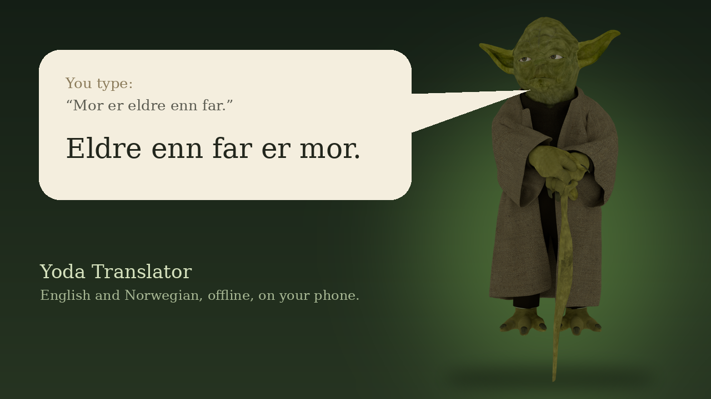

# Yoda Translator



Type English or Norwegian, get it back the way Yoda would say it. It runs on the
phone, offline: a small language model fine-tuned for exactly this job, with a
hand-written rule engine underneath it as a fallback.

| You type | The model says |
|---|---|
| Mor er eldre enn far. | Eldre enn far er mor. |
| Tom sa ikke et ord. | Ikke et ord sa Tom. |
| Du kan spørre barnet som leker der borte. | Spørre barnet som leker der borte kan du. |
| I didn't think Tom was suspicious. | That Tom was suspicious, I did not think. |
| The show was wonderful, but the tickets were too expensive. | Wonderful the show was, but too expensive the tickets were. |

These are real outputs of the phone model on sentences it never saw in training.

## 📲 Download

**[⬇ Latest APK](https://github.com/Matswm86/yoda-translator/releases/download/latest/yoda-translator-26e8411.apk)**
&nbsp;·&nbsp; [all builds](https://github.com/Matswm86/yoda-translator/releases)

**[⬇ Yoda model, 1.1 GB](https://github.com/Matswm86/yoda-translator/releases/download/model-v1/yoda-gemma3-1b.litertlm)**
&nbsp;(download once, it survives app updates)

1. Open the APK link on the phone, tap the file, and allow "install from this
   source" when Android asks. Android 8.0 or newer, 64-bit ARM (any recent phone).
2. Download the model file on the phone too.
3. In the app, tap **Import model file…** at the bottom and pick
   `yoda-gemma3-1b.litertlm`. Copying takes about a minute.

Without the model the app still works, using only the rule engine. The APK
filename carries the commit id, so your browser can never hand you a cached old
build; if the link 404s, a newer build has landed, so take the newest
`yoda-translator-*.apk` from the releases page. Every build is signed with the
same debug key, so updates install over the old version and keep the model.

## What it does

- **Yoda says it.** You type into the speech bubble above Yoda and tap
  **Speak**; he answers in the same bubble, letter by letter, nodding as he
  talks. Tap the bubble to change what you said.
- **Two engines, side by side.** The bubble shows the model's answer once it is
  ready. The rule engine's version sits below it for comparison.
- **Meaning stays put.** Tense, modal verbs (`vil`, `must`) and negation come
  through unchanged. Word forms may bend where Yoda-speak needs it
  (`didn't` → `did not`).
- **Share → Yoda** and a **Yoda** entry in the text-selection menu, so any
  sentence in any app can be sent straight in.
- **No network access at all.** The app does not hold the internet permission.
  Translation runs on the phone and the model is imported from your own storage.

## How it was built

**1. A rule engine first.** `engine/rule/` tags a sentence, cuts it into
constituents and reorders them. It never writes a word form, so it cannot turn
`vil` into `må`. It is fast and safe, and on its own it reads stiffly: in a
blind review a native Norwegian speaker called a random sample of its output
unusable. It stays in the app as the fallback and for comparison.

**2. Picking a teacher.** A local `gemma3:12b` was tried first and changed word
forms in 10–33% of its answers (`vil` → `må`, dropped `hvis`, invented
infinitives). Claude Sonnet, prompted with a handful of reviewer-approved
examples (`corpus/sonnet-teacher-prompt.txt`), was clean on a spot check and
was chosen.

**3. The corpus.** 10,000 sentences (5,000 Norwegian Bokmål, 5,000 English)
from [Tatoeba](https://tatoeba.org), sent to the teacher in batches of 100
(`corpus/distill_sonnet.py`). A meaning gate drops any answer whose negation
count or modal verbs differ from the source: 32 dropped, **9,968 pairs kept**.

**4. Fine-tuning.** LoRA (rank 16, all linear layers, 3 epochs) on Gemma 3,
with 200 pairs held out (`train/train_lora.py`). On the held-out set:

| Model | Same as teacher, word for word | Lines with a real error |
|---|---|---|
| Gemma 3 270M | 52% | about 9 of 200 (mostly Norwegian misspellings) |
| **Gemma 3 1B** (shipped) | 53% | about 4 of 200 |

"Real error" was counted by hand: a misspelt or invented word, a dropped modal,
a changed number. Lines that differ from the teacher but are still good Yoda
are not errors.

**5. On the phone.** The merged 1B model is converted with
[`litert-torch`](https://pypi.org/project/litert-torch-nightly/) to a
`.litertlm` bundle (8-bit weights, 4-bit embeddings, 1.1 GB) and run with
[LiteRT-LM](https://developers.google.com/edge/litert-lm/android). On a desktop
CPU the converted model matched the PyTorch model on 11 of 12 test sentences.

## Known limits

- **Speed and memory on your phone are untested so far.** A 1B model needs
  well over 1 GB of free memory (the file alone is 1.1 GB); low-memory phones may be slow or fail to
  load it, in which case the rule engine still answers.
- **Style is not uniform in Norwegian.** The model mixes verb-second
  (`Opptatt er alle`) and verb-last (`En dømt forbryter, Tom er`), because its
  teacher did.
- **About 2% of lines carry a mistake** (a wrong word form or a dropped word),
  by the held-out count above.

## Build

JDK 17 and the Android SDK (platform 35). CI builds every push to `main` and
publishes the APK; see `.github/workflows/build-android.yml`.

```
./gradlew :app:testDebugUnitTest    # rule engine tests
./gradlew :app:assembleDebug        # APK
```

Rebuilding the model needs a CUDA GPU with 6 GB and the Python scripts in
`corpus/` and `train/`; each script's header shows its command line.

## Layout

```
app/src/main/java/no/mwm/yoda/
  engine/TranslationEngine.kt      the engine contract
  engine/LanguageDetector.kt       English or Norwegian, from function words
  engine/rule/                     tagger, parser, movement rules, renderer
  engine/llm/OnDeviceModelEngine.kt  LiteRT-LM runner and model import
  ui/                              Compose screen: Yoda, the speech bubble, settings
app/src/main/res/drawable-nodpi/yoda.webp  the Yoda image shown in the app
art/                               Blender render script and the README image
corpus/                            pool building, teacher distillation, gates
train/train_lora.py                LoRA fine-tune and held-out evaluation
```

## Licences

The app code is MIT (see `LICENSE`). The model is a derivative of Gemma and is
provided under and subject to the Gemma Terms of Use; the training sentences
come from Tatoeba under CC BY 2.0 FR. The Yoda images are renders of
["Master Yoda"](https://sketchfab.com/3d-models/master-yoda-2fb5a943b7b24ac0b195a74d1a3c6c8d)
by [blazer003](https://sketchfab.com/blazer003), CC BY-NC 4.0. Details in `NOTICE`.
